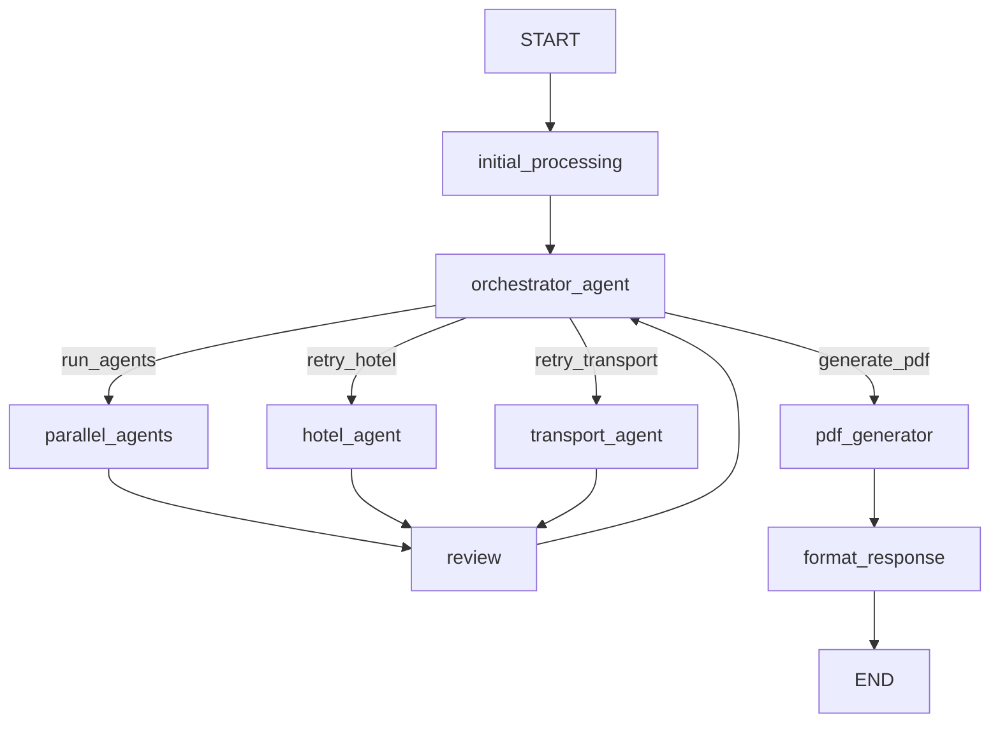

# 🌍 Multi-Agent Trip Planner — LangGraph + GPT-4o-Mini + FAISS

> **Production-Grade Agentic AI System** — Multiple specialized agents collaborating under a Supervisor Orchestrator to generate complete, personalized trip plans with downloadable PDF reports.

---

## 🏗️ System Architecture

```
START
  └─► Orchestrator Agent (brain of the system)
        ├─► Initial Processing
        │     ├─► User Input Agent     (parse & structure query)
        │     └─► Memory Agent         (FAISS vector retrieval)
        │
        ├─► Parallel Agents (data gathering)
        │     ├─► Weather Agent        (conditions & forecasts)
        │     ├─► Transport Agent      (flights, trains, local)
        │     ├─► Hotel Agent          (accommodation options)
        │     ├─► Places Agent         (attractions, restaurants)
        │     ├─► Budget Agent         (cost estimation & optimization)
        │     └─► Itinerary Agent      (day-wise plan)
        │
        ├─► Final Review Agent         (conflict detection)
        │
        ├─► Orchestrator Decision
        │     ├─► Retry Hotel?          (if budget overrun)
        │     ├─► Retry Transport?      (if unavailable)
        │     └─► Approved?
        │
        ├─► Memory Update Agent        (persist preferences)
        ├─► PDF Generator Agent        (professional report)
        └─► Format Response → END
```

### Key Design Principles

| Principle | Implementation |
|-----------|----------------|
| **Orchestrator Pattern** | Supervisor agent controls all routing decisions |
| **RAG Architecture** | FAISS + OpenAI embeddings for knowledge retrieval |
| **State Machine** | LangGraph TypedDict state flows through all agents |
| **Conflict Resolution** | Orchestrator detects & retries failed agents |
| **Multi-turn Memory** | Conversation history + user profile persistence |
| **Professional Output** | ReportLab PDF with 7 sections |

---

## 📁 Project Structure

```
trip_planner/
├── main.py                    # Entry point — CLI & demo
├── workflow.py                # LangGraph graph construction
├── state.py                   # TripState TypedDict schema
├── config.py                  # Environment & settings
├── requirements.txt
├── .env.example               # Copy → .env and add keys
│
├── agents/
│   ├── agents.py              # 9 specialized agents
│   └── orchestrator.py        # Orchestrator + router + formatter
│
├── tools/
│   └── pdf_generator.py       # ReportLab PDF report generator
│
├── data/
│   └── knowledge_base.py      # Travel docs + FAISS index builder
│
└── output/                    # Generated PDF reports
```

---

## ⚙️ Setup Instructions

### 1. Clone / Copy the project

```bash
cd trip_planner
```

### 2. Install dependencies

```bash
pip install -r requirements.txt
```

### 3. Configure environment

```bash
cp .env.example .env
```

Edit `.env` and add your keys:

```env
OPENAI_API_KEY=sk-...          # Required
OPENWEATHER_API_KEY=...        # Optional (live weather)
GOOGLE_MAPS_API_KEY=...        # Optional (live routes)
```

### 4. Build the FAISS knowledge base

```bash
python main.py --build-index
```

This embeds ~20 travel documents (Goa, Manali, Kerala, Rajasthan, Bali, Paris) using `text-embedding-3-small` and saves the FAISS index to `./data/faiss_travel_index/`.

---

## 🚀 Usage

### Run the built-in demo (recommended first run)

```bash
python main.py --demo
```

Demonstrates a 2-turn conversation:
1. Plan a 5-day Goa trip for a couple (₹30,000 budget)
2. Refine with cheaper hotel + itinerary update

### Interactive CLI

```bash
python main.py
```

### Single query

```bash
python main.py --query "Plan a 7-day Kerala trip from Mumbai for a family of 4, budget ₹80,000"
```

### Python API

```python
from workflow import TripPlanner

planner = TripPlanner()

# Initial plan
result = planner.plan(
    "Plan a 5-day Goa trip from Bangalore for a couple. "
    "Budget ₹30,000. Beach resort, nightlife, seafood, flight preferred."
)
print(result["final_response"])
print(f"PDF: {result['pdf_path']}")

# Multi-turn refinement
result2 = planner.refine("Can you find a cheaper hotel option?")
```

---

## 🤖 Agent Details

### Orchestrator Agent (`agents/orchestrator.py`)
- **Brain of the system** — makes all routing decisions
- Runs before and after each agent batch
- Detects conflicts: budget overrun → retry Hotel Agent; transport failure → retry Transport Agent
- Max 5 iterations before forcing output (safety limit)
- Compiles the final human-readable markdown response

### User Input Agent
- Calls GPT-4o-Mini to parse raw user text into structured JSON
- Extracts: source, destination, dates, budget, travelers, preferences
- Multi-turn aware: merges with existing preferences on refinement

### Memory Agent
- Embeds user query with `text-embedding-3-small`
- Retrieves top-8 relevant docs from FAISS index
- Categorises docs (weather, hotels, transport, attractions, etc.)
- Provides context to all downstream agents

### Weather Agent
- Uses retrieved weather docs + LLM reasoning
- Returns: temperature range, conditions, clothing advice, beach/outdoor suitability
- Triggers Places Agent retry if heavy rain detected

### Transport Agent
- Primary + alternative transport options
- Local transport (scooter, taxi, auto) cost estimation
- Retry: switches transport mode on failure (flight → train → bus)

### Hotel Agent
- Recommends hotel + 2–3 budget alternatives
- Retry: downgrade luxury tier (luxury → mid-range → budget)
- Checks: within_budget flag for Orchestrator

### Places Explorer Agent
- Top 5 attractions, 4 restaurants, 4 activities
- Filters by weather suitability (no beach in rain)
- Personalised to interests & travel type

### Budget Agent
- Itemised cost breakdown (transport, hotel, food, activities, misc)
- Calculates surplus/deficit vs. user budget
- Generates 3–5 optimization tips

### Itinerary Agent
- Day-by-day schedule (morning/afternoon/evening/night)
- Meals, accommodation, estimated daily cost
- Packing checklist + emergency contacts

### Final Review Agent
- Validates: budget within range, hotel OK, itinerary complete
- Returns list of conflicts → Orchestrator decides retry or approve

### PDF Generator (`tools/pdf_generator.py`)
- 7-section professional PDF using ReportLab
- Cover page → Weather → Transport → Hotel → Itinerary → Budget → Packing + Emergency

---

## 📊 LangGraph State Schema

```python
class TripState(TypedDict):
    # Conversation
    messages: Annotated[list, add_messages]
    user_query: str
    conversation_history: List[Dict]

    # Structured preferences
    user_profile: Dict
    trip_preferences: Dict       # source, destination, budget, dates, ...

    # Agent outputs
    weather_data: Dict
    hotel_data: Dict
    transport_data: Dict
    places_data: Dict
    budget_summary: Dict
    itinerary: Dict
    review_status: Dict
    memory_context: Dict
    retrieved_docs: List[Dict]

    # Orchestrator control
    orchestrator_decision: Dict  # next_step, approved, conflicts
    current_agent: str
    retry_count: Dict[str, int]
    errors: List[str]
    iteration: int

    # Outputs
    final_response: str
    pdf_status: Dict
    pdf_path: Optional[str]
```

---

## 🗺️ LangGraph Workflow (Mermaid)



---

## 📄 PDF Report Sections

| Section | Content |
|---------|---------|
| Cover Page | Trip title, route, dates, key facts |
| 1. Weather | Temperature, conditions, clothing advice |
| 2. Transport | Flights/trains, alternatives, local transport |
| 3. Accommodation | Recommended hotel + alternatives |
| 4. Day-wise Itinerary | Morning/afternoon/evening/night + meals |
| 5. Budget Report | Itemised table, surplus/deficit, tips |
| 6. Packing Checklist | Two-column checklist |
| 7. Emergency Contacts | Police, ambulance, tourist helpline + tips |

---

## 🔧 Configuration

| Variable | Default | Description |
|----------|---------|-------------|
| `OPENAI_API_KEY` | — | Required |
| `LLM_MODEL` | `gpt-4o-mini` | OpenAI chat model |
| `EMBEDDING_MODEL` | `text-embedding-3-small` | Embedding model |
| `FAISS_INDEX_PATH` | `./data/faiss_travel_index` | FAISS index location |
| `PDF_OUTPUT_DIR` | `./output` | PDF save directory |
| `MAX_RETRY_PER_AGENT` | `2` | Max retries per agent |
| `MAX_ORCHESTRATOR_ITERATIONS` | `5` | Safety limit for loops |
| `RETRIEVAL_TOP_K` | `8` | FAISS top-k results |

---

## 🧩 Extending the System

### Add a new destination to the knowledge base
Edit `data/knowledge_base.py` → `TRAVEL_DOCUMENTS` list, then rebuild:
```bash
python main.py --build-index
```

### Add a new agent
1. Define `my_new_agent(state: TripState) -> Dict` in `agents/agents.py`
2. Add a node in `workflow.py`: `graph.add_node("my_agent", my_new_agent)`
3. Connect it with edges and update the orchestrator router

### Add live APIs
- **OpenWeatherMap**: In `weather_agent`, replace LLM simulation with `requests.get("api.openweathermap.org/...")`
- **Flight Search**: In `transport_agent`, integrate Amadeus or Skyscanner API
- **Google Places**: In `places_agent`, call the Places API with your `GOOGLE_MAPS_API_KEY`

---

## 📋 Sample Queries

```
# Domestic India
"Plan a 5-day Goa trip from Bangalore for a couple, budget ₹30,000, beach resort, nightlife"
"7-day Kerala backwaters + hill stations trip from Mumbai, family of 4, budget ₹80,000"
"4-day Manali trip from Delhi for a group of 6, adventure activities, budget ₹60,000"
"3-day Jaipur heritage trip from Hyderabad, solo traveller, budget ₹15,000"

# International
"10-day Bali honeymoon from Bangalore, luxury villas, budget $3,000"
"7-day Paris trip from Mumbai, first time Europe, mid-range budget €2,000"
```

---

## ✅ Deliverables Checklist

- [x] Architecture Diagram (see above)
- [x] LangGraph Workflow (StateGraph with conditional edges)
- [x] Agent Design (10 specialized agents)
- [x] Orchestrator Logic (conflict detection + retry + approval)
- [x] Tool Design (FAISS retrieval, LLM reasoning)
- [x] Memory System (FAISS vector store + conversation history)
- [x] PDF Generator Module (7-section ReportLab report)
- [x] Prompt Design (structured JSON outputs from each agent)
- [x] State Schema (TripState TypedDict)
- [x] Complete Codebase (all modules, runnable)
- [x] Setup Instructions
- [x] Example Usage (demo + interactive CLI)

---

*Built with LangGraph · OpenAI GPT-4o-Mini · FAISS · ReportLab*
